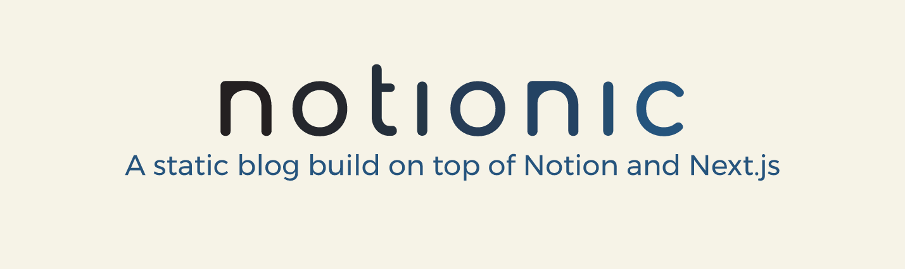

# Notionic

Notionic is a static blog that updates in real time, synchronizing changes to Notion pages without rebuilding the deployment.

## Features

- Incremental static regeneration
- Outline
- Theme switch
- Multi-language
- Native style comments
- Loading and transition animation
- Block page support
- SEO and Open Graph optimization
- Newsletter support
- Contact Form
- Telegram bot integration

## Reference & Licenses

- [Notion-X](https://github.com/NotionX/react-notion-x)
- [Nobelium](https://github.com/craigary/nobelium)
- [NotionNext](https://github.com/tangly1024/NotionNext)

The MIT License.
